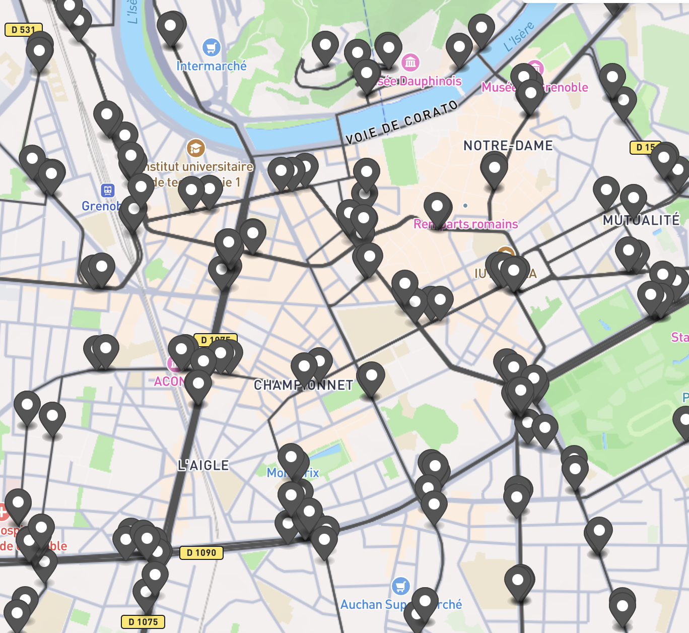

# Grenoble Transport Interactive Map

An interactive web application that displays routes and public transportation in Grenoble using GEOJSON files and the MTAG API.

## Features

- Interactive map with Leaflet displaying routes and public transport
- Filter options for route types (roads, paths) and transport types
- Real-time transit schedules from the MTAG API
- Route optimization between points
- Detailed information about routes and stops

## Technology Stack

### Frontend
- React
- Leaflet for interactive maps
- Axios for API requests

### Backend
- Python with FastAPI
- GeoJSON processing
- External API integration

## Project Structure

```
grenoble-transport-map/
├── backend/               # Python FastAPI backend
│   ├── app.py             # Main server file
│   └── requirements.txt   # Python dependencies
├── frontend/              # React application
│   ├── public/            # Static files
│   └── src/               # React components and styles
├── grenoble.geojson       # Roads and paths data
└── data_transport_commun_grenoble.geojson  # Transport data
```

## Setup Instructions

### Backend Setup

1. Navigate to the backend directory:
   ```bash
   cd backend
   ```

2. Create and activate a virtual environment (optional but recommended):
   ```bash
   python -m venv venv
   source venv/bin/activate  # On Windows: venv\Scripts\activate
   ```

3. Install dependencies:
   ```bash
   pip install -r requirements.txt
   ```

4. Run the server:
   ```bash
   uvicorn app:app --reload
   ```
   The API will be available at http://localhost:8000

### Frontend Setup

1. Navigate to the frontend directory:
   ```bash
   cd frontend
   ```

2. Install dependencies:
   ```bash
   npm install
   ```

3. Start the development server:
   ```bash
   npm start
   ```
   The application will be available at http://localhost:3000

## API Endpoints

- `GET /api/mtag/{route_name}` - Get schedule data for a specific route
- `GET /api/geojson/routes` - Get all routes data
- `GET /api/geojson/transport` - Get all transport data
- `GET /api/routes/filter` - Filter routes by type and/or max speed
- `GET /api/optimize` - Calculate optimized route between two points

## Data Sources

- MTAG API for real-time transit schedules
- GeoJSON files for route and transport infrastructure data

# Les routes : GEOJSON

Le fichier **grenoble.geojson** contient toutes les données sur les routes de Grenoble et ses alentours (voir photo à la fin).

Ce format est équivalent à du JSON vous devrez donc le lire et potentiellement y écrire avec votre langage préféré.

Toutes les données se trouve dans "features", chaque éléments peut être une route, une piste cyclable, un passage piéton, un tunnel, une autoroute,...

Les objets possèdent un attribut **"geometry"** qui contient une liste de coordonnées dessinant la route. Deux routes qui se croisent partageront donc au moins une coordonnée identique parmi toutes celles présentes dans leur liste.

Dans leur attribut **"properties"**, on peut identifier si ce sont des routes pour voitures, vélos ou piétons. On y trouve également des informations comme la vitesse autorisée pour les voitures, le type de surface, etc.


# Les transport en commun : 

## Le fichier GEOJSON

Le fichier **data_transport_commun_grenoble.geojson** contient toutes les données sur les trajets de tous les transports en commun de Grenoble et ses alentours (voir photo à la fin).

Ce format est équivalent à du JSON vous devrez donc le lire et potentiellement y écrire avec votre langage préféré.

Il y a deux types d'éléments, les points qui représentent des arrêts, et les lignes qui sont les parcours des différents transports en commun.



## Exemple de l'utilisation de l'API

lien : https://data.mobilites-m.fr/donnees 

Le dossier **mtagAPI** comporte un fichier java et un fichier python, qui sont chacun les éboches d'une librairie permettant de récupérer et d'utiliser les fichiers json de l'API mtag. Il est intéressant de noter que vous pouvez récupérer plein d'autres informations sur le site cité si-dessus.  

Ces prototypes sont utiles car la fonction donné permet de récupérer la fiche horaire des différents transports de la métropole de Grenoble.# hackathonMargo
# margo
